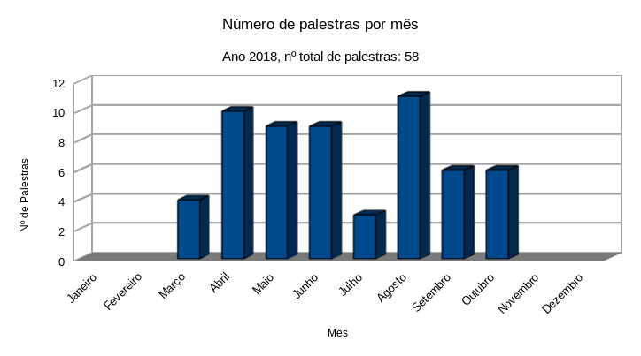

| **Mês**    | **Nº de palestras** |
| ---------- | ------------------- |
| Janeiro	   | 0	                 |
| Fevereiro	 | 0	                 |
| Março	     | 4	                 |
| Abril	     | 10	                 |
| Maio	     | 9	                 |
| Junho	     | 9	                 |
| Julho	     | 3	                 |
| Agosto	   | 11	                 |
| Setembro	 | 6	                 |
| Outubro	   | 6	                 |
| Novembro	 | 0	                 |
| Dezembro	 | 0	                 |
| ---------- | ------------------- |
| Total	     | 58	                 |

&nbsp;

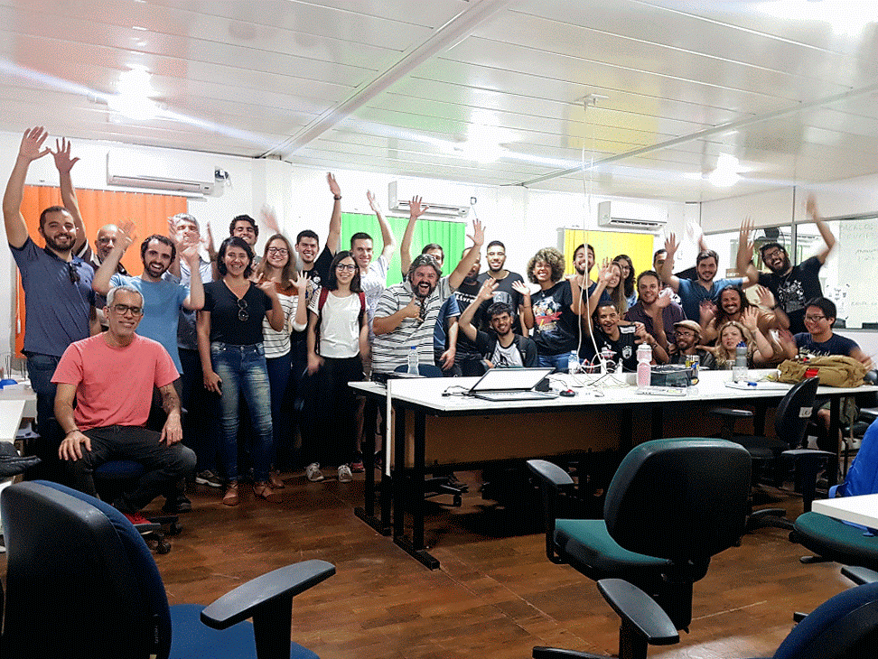

### 26/março, Edson Ma, Como construir seu instrumento musical

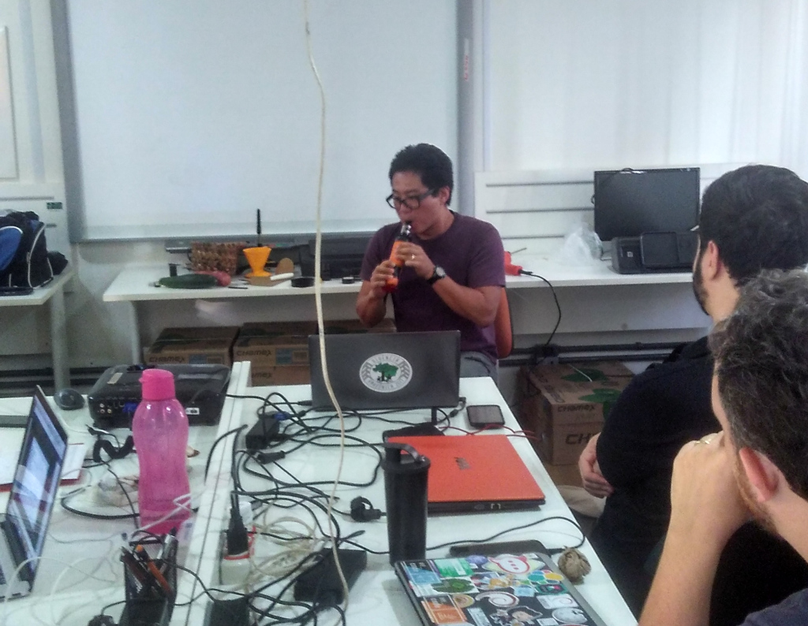

### 26/março, Fábio Mendes, FGAme

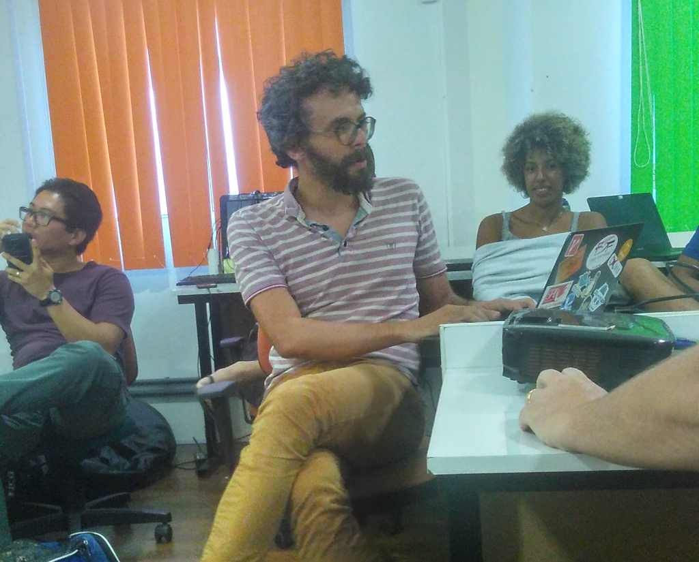

### 26/março, Ricardo Poppi, Máquina de Anticítera

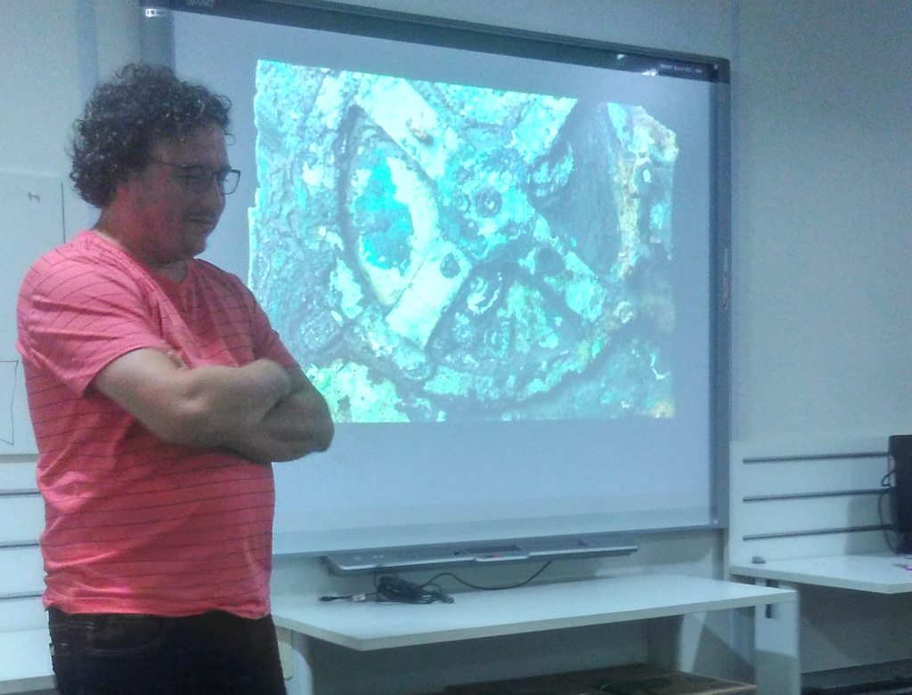

### 02/abril, Milene, Computação Ubíqua

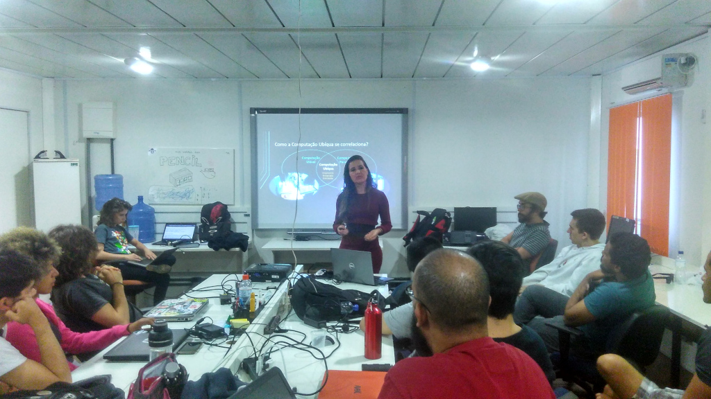

### 16/abril, Arthur Jahn, PRPL Pattern e estratégias para servir progressive web applications

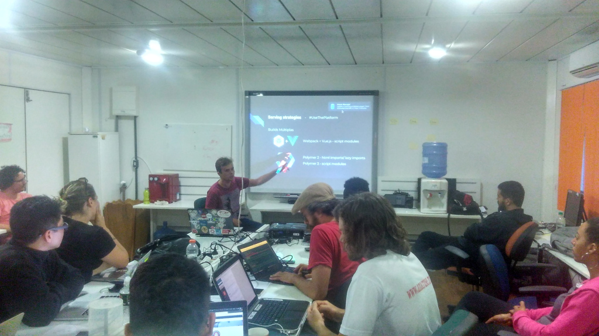

### 30/julho, Andrés, Cuidando e Monitorando: ferramentas livres para engajamento cidadão

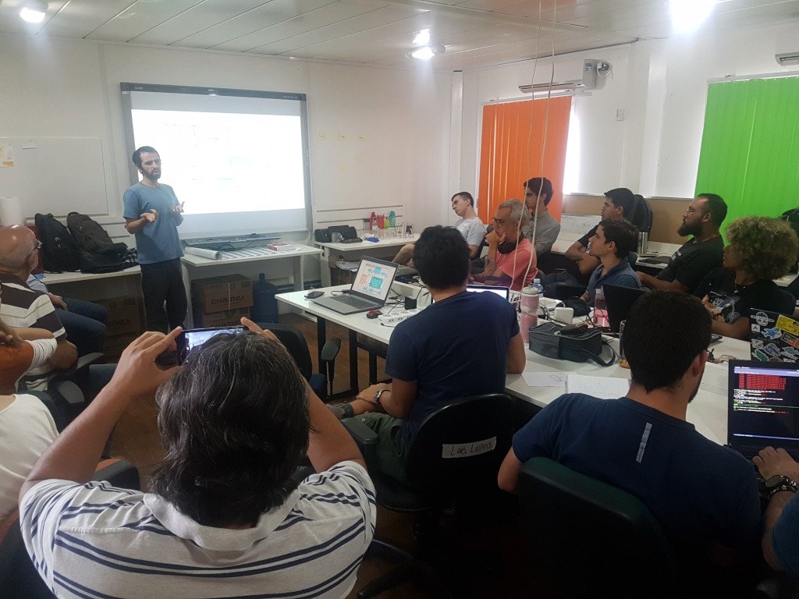

### 06/agosto, Fábio Café, Dinamica Artística

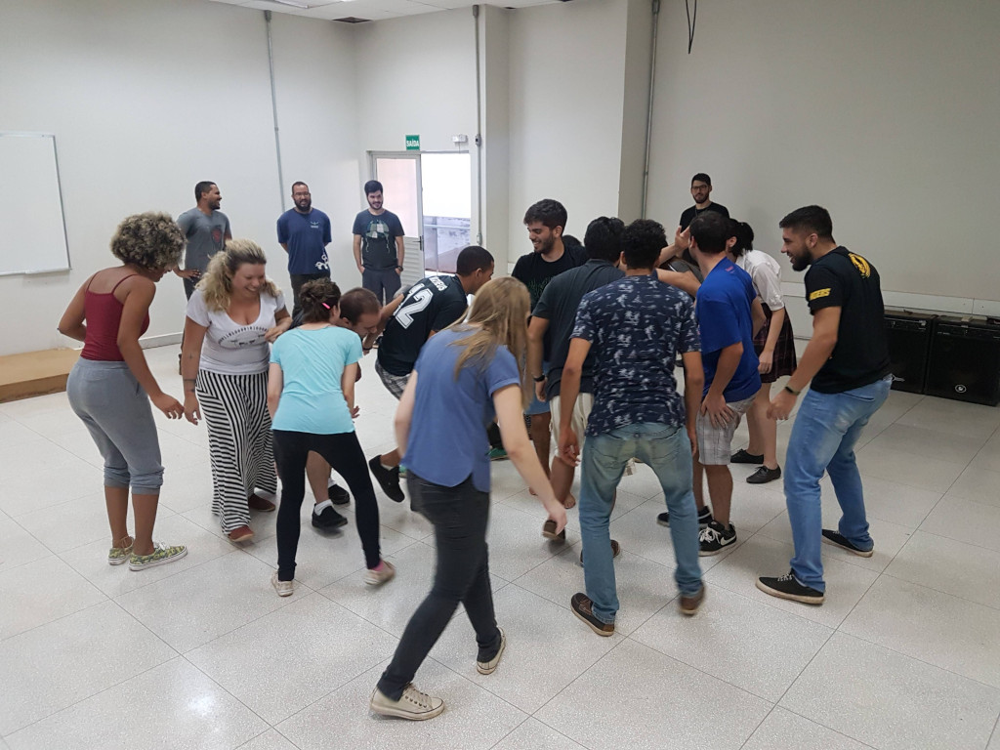

### 13/agosto, Athos Ribeiro, Vida após Lappis

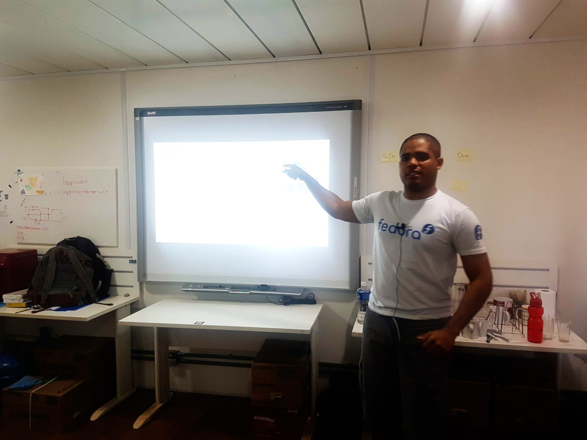

### 20/agosto, Arthur Temporim e Bruna Pinos, Framework de bots no Rocket.Chat

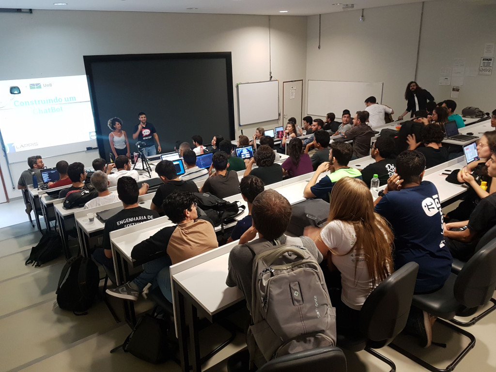
